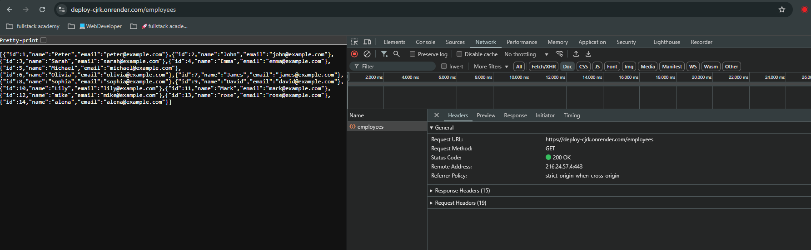
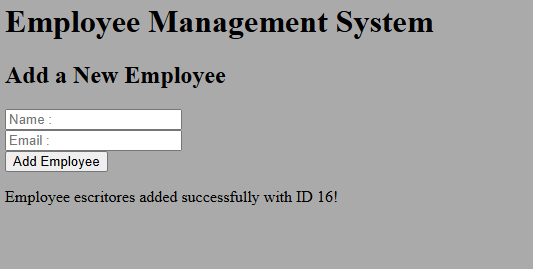
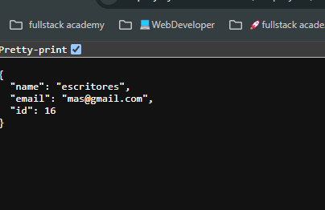

# REACT | BACKEND | API

# Employee's data on the server 

Here is the link : https://deploy-cjrk.onrender.com/employees

# Adding employee
Here is the link : https://deploy-cjrk.onrender.com/

to find the data added use base url + employee + id, 
| Employee escritores added successfully with ID 16! |
like ex, in this case id : 16 was added 
Here is the link : https://deploy-cjrk.onrender.com/employees/16

